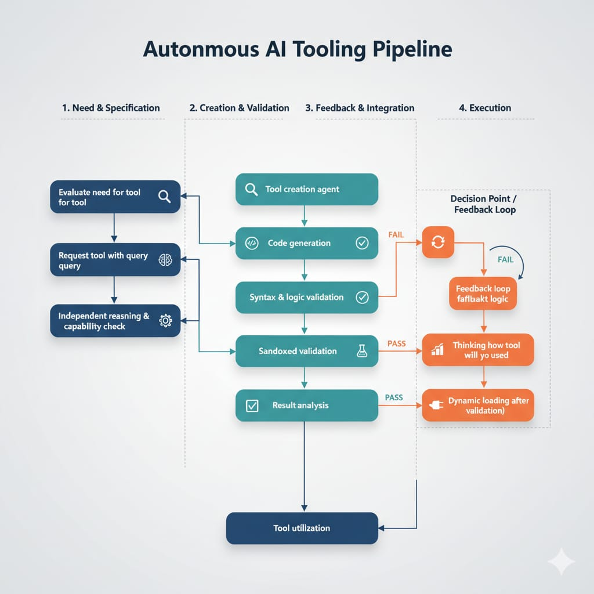
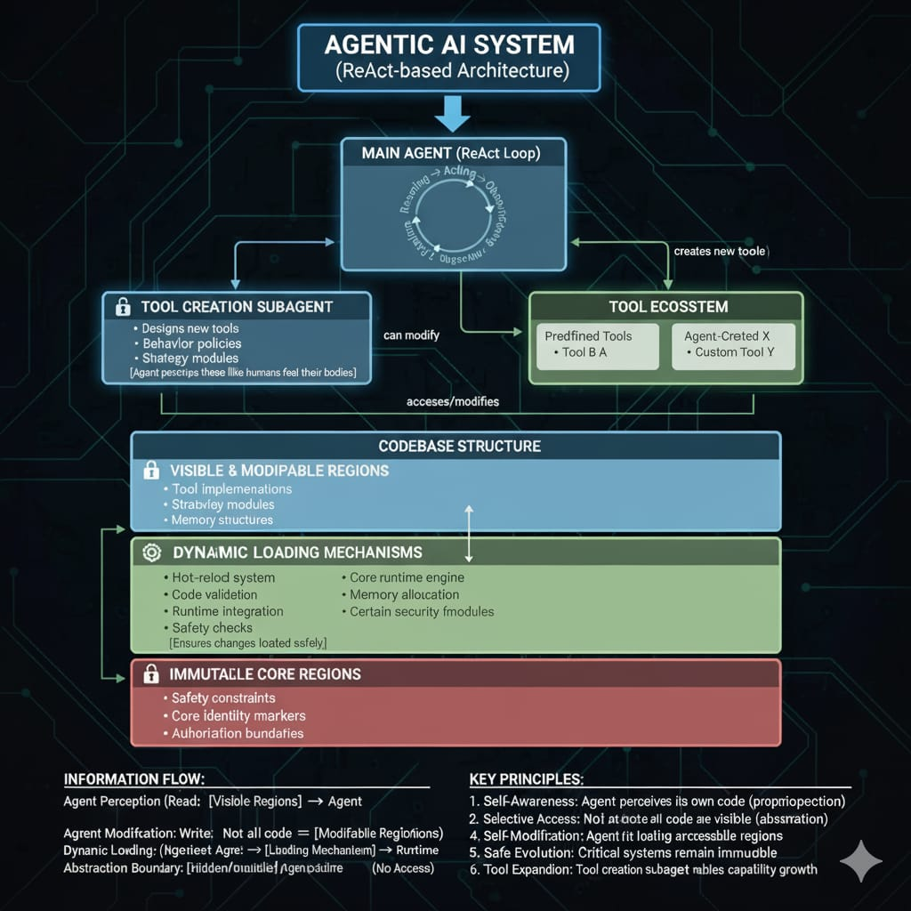

Evaluate the need for tool -> request for a tool with a query -> independent reasoning for tool requirement and capability check -> tool creation agent -> code generation -> syntax and logic validation -> Sand boxed validation -> result analysis -> feedback loop fallback logic for the function -> thinking how the tool will be used and reasoning-> dynamic loading after validation -> tool utilization

Tool creation sub Agent :

Challenges:

1. Inference provider
2. Logging and data analysis 
3. Goal allignment and result declaration 
4. Technical challenges with the coding and 

Keys :

1. Uses persistent memory, searches memory, retrieves cool memories and saves as required 
2. Ability to create new tools

Belief:

1. The agent has the ability to view it's own code, it has the access to view it's own codebase like humans have the ability to feel their bodies 
2. Some parts of the codebase are abstracted and encapsulated from the agent
3. The agent can modify and alternate it's own codebase and mechanisms which are abstracted from the agent ensure the changes are loaded dynamically within the runtime
4. Some parts of the codebase cannot be modified just like how some parts of the codebase are abstracted 
5. The agent is inspired by a ReAct based agents with a tool creation subagent which is a key piece of the model architecture 
6. There are defined tools which can be accessed by the agents and there are other tools which were created by the tools 

Architecture of the system:

